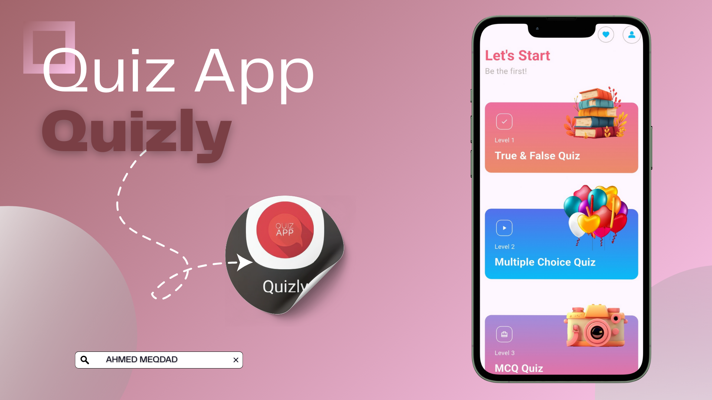
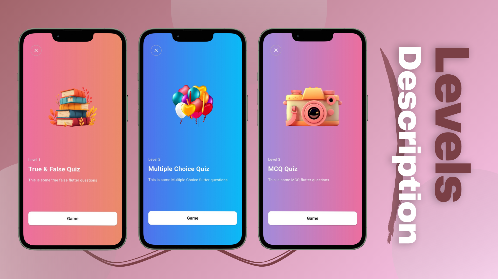
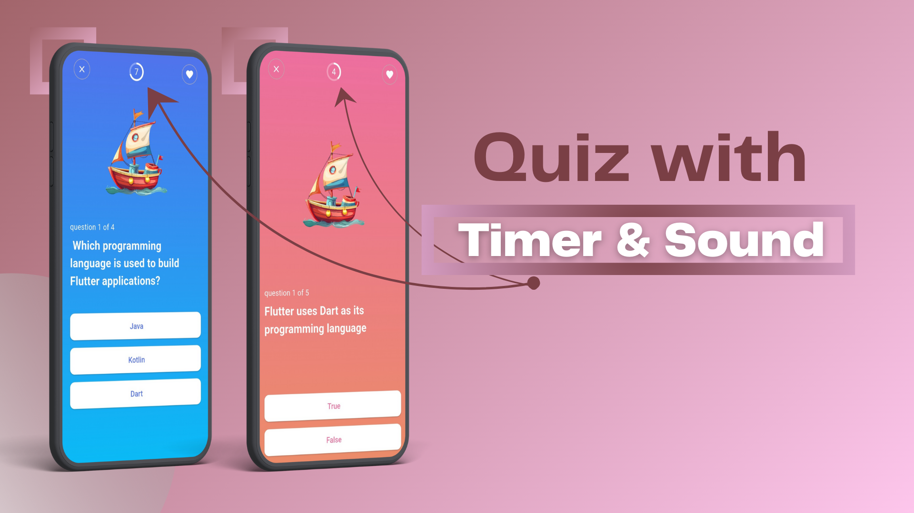
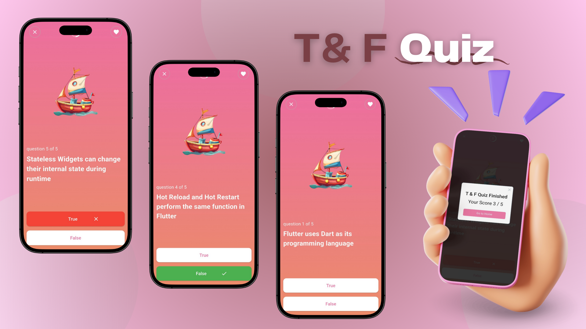
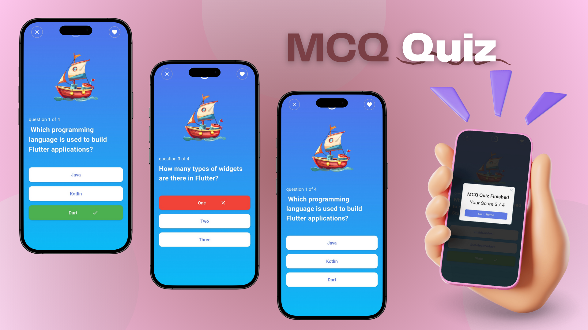

# 🎯 Quiz App 

## ✅ Project Overview  
**Quiz App** (also known as *Quizly*) is an interactive quiz application built with **Flutter**.  
It offers three fun and educational quiz modes — **True/False**, **Multiple Choice**, and **Timed Quizzes** — with engaging UI, smooth animations, and sound effects.  
This project is ideal as a learning resource or a solid starting point for a more advanced quiz app.

---

## 🧰 Tech Stack  
- **Framework:** Flutter  
- **Language:** Dart (SDK constraint ^3.8.1)  
- **Packages Used:**  
  - `rflutter_alert` → for displaying quiz result dialogs  
  - `audioplayers` → for countdown ticking sounds  
  - `flutter_launcher_icons` → to generate app icons  
  - `flutter_lints` → for linting and code style  
- **Supported Platforms:** Android, iOS

---

## 🏗 Architecture  
The app follows a clean and modular structure that separates UI, logic, and reusable components for better maintainability.

## ✨ Features  
- Multiple quiz modes: True/False, Multiple Choice, Timed Quizzes  
- Countdown timer with animated circular progress  
- Ticking sound for time-based quizzes  
- End-of-quiz alerts using `rflutter_alert`  
- Score tracking and feedback icons  
- Clean UI with gradient backgrounds and level illustrations  
- Cross-platform support (Android, iOS, Web)

---

## 🚀 How to Run the Project

1. **Clone the repository**  
- git clone https://github.com/a7med2002/quiz_app.git

2. **Install dependencies** 
- flutter pub get

3. **Run the app**
- flutter run

---

## 🖼️ Screenshots

---

## 🌐 Social Links
- 👨‍💻 Developer: [ِAhmed Meqdad]
- 📧 Email: [ahmd2002mqdad@gamil.com]
- 💼 LinkedIn: [linkedin.com/in/ahmed-meqdad](https://www.linkedin.com/in/ahmed-meqdad)