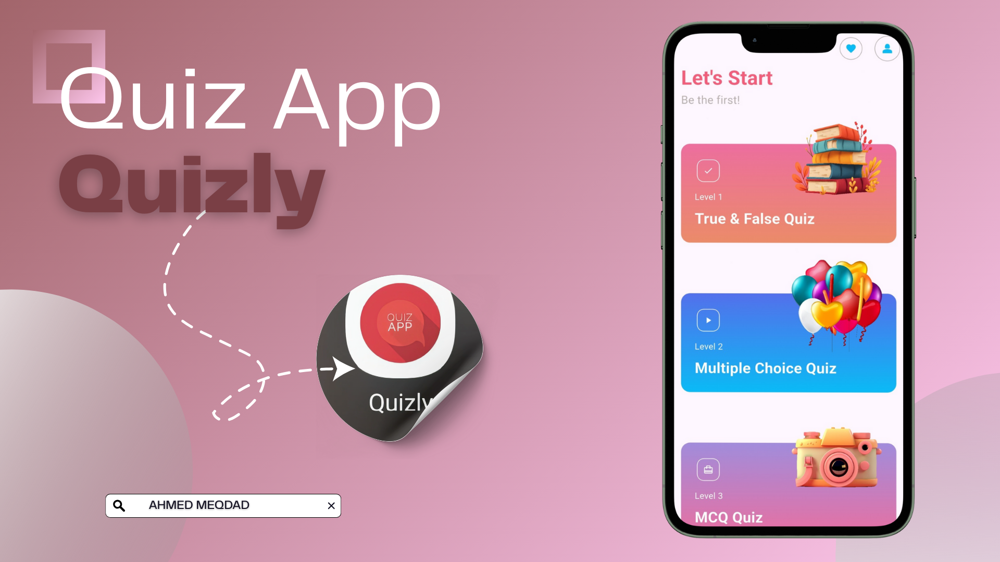
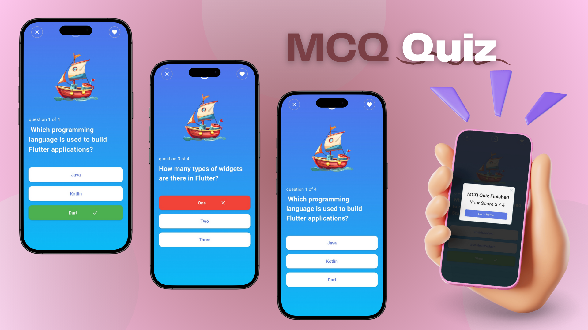

# quiz_app

A new Flutter project.

## Description

Quizly App is a quiz app with two types of questions true fasle and multiple choice and every question with timer duaration 10 seconds, and timer with sound, when finish quiz ==> show your score.

App Folders:
    helepr: contain constants colors of app.
    modules: contain Data & logic of classes of questions.
    screens: contain Ui of screens.
    widgets: contain custom reusable widgets.

Packges:
    rflutter_alert: to show an Alert Dialog wiht buttons.
    audioplayers: to play sound of quiz timer.

## Home View

## Levels Descriptions View

## Timer View

## True False View

## MCQ View

